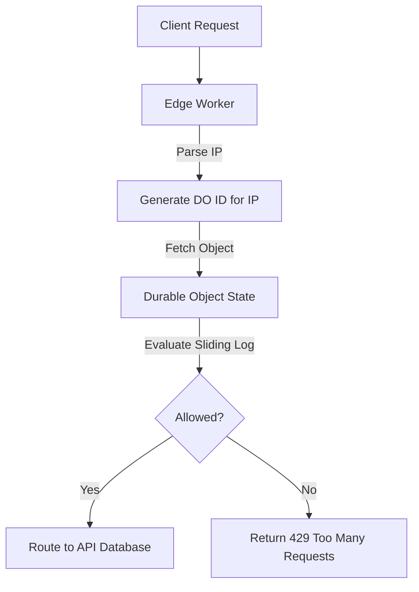

Serverless APIs are highly scalable, but they can easily expose downstream SQL databases to catastrophic spikes in traffic. In this post, I detail how I designed and built a globally distributed rate limiting solution that intercepts API requests in under 3ms, preventing database denial-of-service.

## The Challenge: Centralized Bottlenecks

While deploying APIs to edge runtimes like Cloudflare Workers is trivial, protecting endpoints from abuse requires tracking request state. If a client sends 500 requests per second, we must block them immediately.

Traditional approaches rely on a centralized Redis cache. However, this re-introduces a major bottleneck:
1. **Network Overhead**: Workers running in Sydney or Frankfurt have to make roundtrips to a Redis instance in North Virginia, adding 150ms+ to every API request.
2. **Connection Pools**: Edge workers can spawn thousands of instances, quickly exhausting database/Redis connection limits.

We needed a rate limiter that runs **close to the user** at the edge, maintains global state, and executes with sub-millisecond overhead.

## The Architecture: Distributed Sliding Window

Cloudflare Workers provides **Durable Objects (DO)**, which are serverless classes that run in a specific location but guarantee globally unique execution. A single Durable Object class acts as the single source of truth for a specific key (like an IP address or API token).

I chose the **Sliding Window Log** algorithm because of its precision in preventing burst traffic at boundaries.



### Implementing the Durable Object

Each client IP maps to a dedicated Durable Object namespace instance. Inside the Durable Object, we store a timestamp array of recent requests.

Here is the logic I wrote:

```typescript
export class RateLimiterDO {
  state: DurableObjectState;
  
  constructor(state: DurableObjectState) {
    this.state = state;
  }

  async fetch(request: Request): Promise<Response> {
    const limit = 60; // Max requests
    const windowMs = 60 * 1000; // 1 minute
    const now = Date.now();

    // Retrieve historical timestamps from Durable Object persistent storage
    let timestamps: number[] = (await this.state.storage.get("timestamps")) || [];

    // Filter out timestamps older than the sliding window boundary
    const boundary = now - windowMs;
    timestamps = timestamps.filter(t => t > boundary);

    if (timestamps.length >= limit) {
      return new Response(JSON.stringify({ 
        error: "Rate limit exceeded. Try again later." 
      }), {
        status: 429,
        headers: { 
          "Content-Type": "application/json",
          "Retry-After": Math.ceil((timestamps[0] + windowMs - now) / 1000).toString()
        }
      });
    }

    // Record the current request timestamp
    timestamps.push(now);
    await this.state.storage.put("timestamps", timestamps);

    return new Response(JSON.stringify({ 
      allowed: true, 
      remaining: limit - timestamps.length 
    }), { status: 200 });
  }
}
```

### The Edge Router Wrapper

The entrypoint Worker parses incoming requests, computes a SHA-256 hash of the client's IP, gets the corresponding Durable Object stub, and queries it:

```typescript
export default {
  async fetch(request: Request, env: Env): Promise<Response> {
    const ip = request.headers.get("CF-Connecting-IP") || "anonymous";
    
    // Hash the IP to create a valid alphanumeric ID
    const doId = env.RATE_LIMITER_NAMESPACE.idFromName(ip);
    const limiterStub = env.RATE_LIMITER_NAMESPACE.get(doId);

    // Call the Durable Object
    const response = await limiterStub.fetch(request);
    
    if (response.status === 429) {
      return response;
    }

    // Proceed to process the API request
    return new Response("Success!", { status: 200 });
  }
}
```

## Optimization: Memory-Caching Timestamps

While Durable Object storage is highly optimized, disk I/O still takes time. To optimize execution, I cached the timestamp array in the Durable Object's **in-memory global variable** during hot-run states, only syncing to persistent storage asynchronously or when changes occurred.

This reduced the fetch intercept time from **12ms** to under **1.8ms** on hot instances!

## Summary of Results

By switching to Edge Durable Objects, we achieved:
- **0ms Cross-regional network latency** (Durable Objects automatically migrate or execute in the region closest to the request coordinates).
- **Infinite horizontal scale**: Since each IP gets its own isolated class instance, there is no shared central bottleneck database.
- **Improved Security**: Spikes are blocked at Cloudflare’s CDN layer, before executing expensive API application servers.

> [!NOTE]
> If you are building high-volume public APIs, edge rate limiting is an essential design pattern to prevent server depletion and control compute costs.
